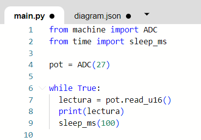
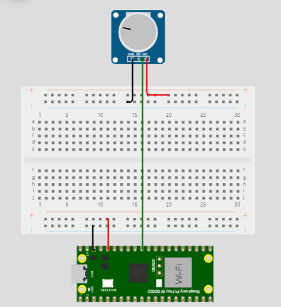
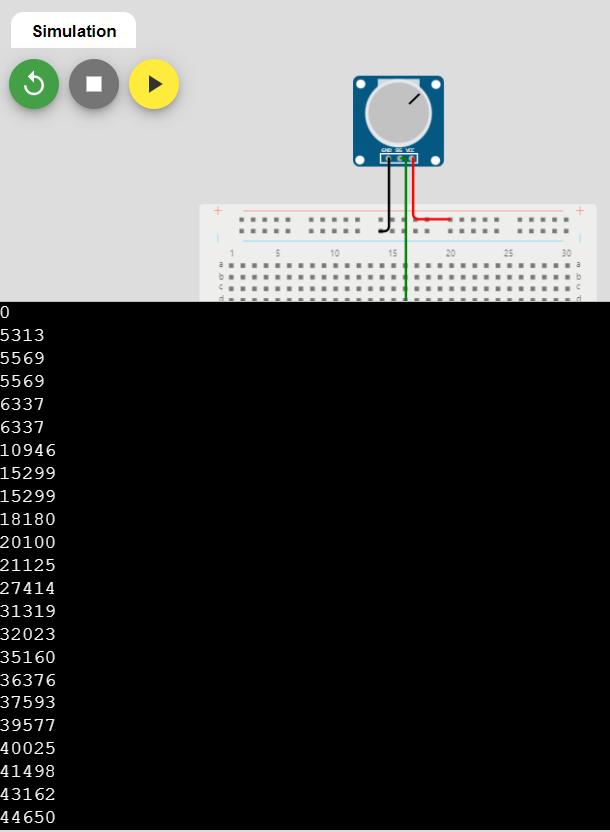

# Sensores

### Depto de Sistemas y Computación
### Ing. En Sistemas Computacionales
### SISTEMAS PROGRAMABLES 23a
### **Autor:** *Guipzot Garibay Denisse Abigail 20211788*
### Exposición U1 
### Fecha de revisión: 13/09/2023

#### __¿Qué es un potenciómentro?__

Se trata de un componente eléctrico de tres terminales, el cual se clasifica como una resistencia que es capaz de modificar o ajustar el valor del voltaje, controlando el flujo de corriente que pasa a través de este; esta resistencia variable permite provocar una _caída de tensión_ para posteriormente ser regulado de manera manual. El valor de los potenciómetros es expresado en ohms Ω.

#### __Estructura interna de un potenciómetro__

* __Terminales fijos:__ un potenciómetro cuenta con dos terminales fijos
* __Terminal variable:__ parte del componente encargada de permitir que se realicen modificaciones en el valor del voltaje.
* __Cursor:__ también conocido como perilla, es el elemento que se utiliza para realizar la variación del valor de la resistencia. 
* __Material resistivo:__ material que evita o dificulta el paso de la corriente eléctrica.

#### __¿Para qué sirve un potenciómetro?__

Su objetivo general dentro de los circuitos, es ayudar a otros dispositivos electrónicos a variar la intensidad de sus características, es decir, intervienen dentro del circuito para realizar un cambio gradual de voltaje o resistencia.

* _Aplicaciones_
  * Controlar brillo, contraste y color en pantallas.
  * Regular el volumen.
  * Cambio de velocidad.
 

#### __Funcionamiento__

La variación se produce cuando la terminal móvil se mueve y la resistencia que está presente en esta terminal y una terminal fija cambia de proporción al desplazamiento angular; en otras palabras, en cuanto más material resistivo exista entre el terminal fijo y la posición del cursor, mayor será el valor de la resistencia que proporciona el dispositivo. 

#### __Tipos__

* _Clasificados según el tipo de mando:_
  * __Rotatorio:__ Es aquel en el que el valor de la resistencia se controla girando un eje.
  * __Deslizante:__ Contiene una pista resistiva recta, con un cursor que realiza un recorrido recto.
  * __Múltiple:__ Se trata de varios potenciómetros con sus ejes colocados de forma coaxial.
  * __De ajuste:__ Son aquellos que vienen preajustados de fábrica.
 
 * _Clasificados según la variación de la resistencia:_
   * __Lineal:__ El valor varia de manera proporcional a la posición del cursor.
   * __Logarítmico:__ Su funcionamiento se basa en una relación logarítmica entre el valor y la posición del cursor, siendo el valor muy sensible al cambio de posición del cursor.
   * __Senoidal:__ La resistencia es proporcional al seno de la posición del cursor.
   * __Exponencial:__ El valor de la resistencia es exponencial a la posición de la perilla.
  
#### __Ejemplo de un circuito con potenciómetro__

#### Referencias bibliográficas

### Conclusión
_Sobre este trabajó exploré y comprendí a profundidad todo lo que engloba a los potenciómetros; si bien, como muchos de los componentes eléctricos y electrónicos es una pieza pequeña, es un elemento importante dentro de los circuitos, ya que permite controlar, variar y manipular el flujo de voltaje sobre dicho sistema, y aunque no estemos familiarizados con este componente, es una herramienta que está presente en varios equipos que utilizamos._

